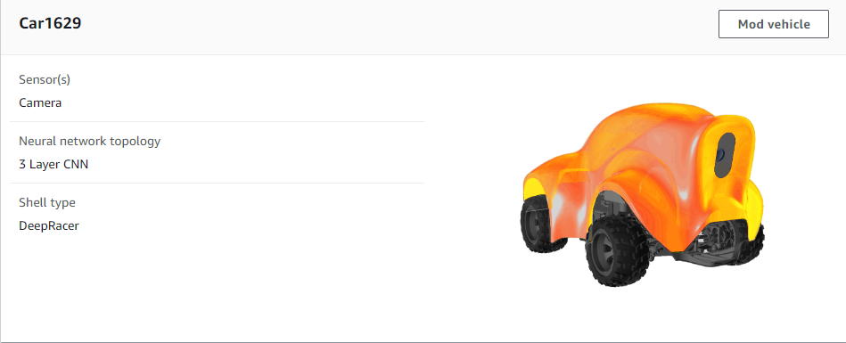

# Chương 2. Xây dựng mô hình
## 2.1. Ga-ra
### 2.1.1. Phương tiện mặc định
- Định cấu hình phương tiện của bạn bằng một hoặc nhiều cảm biến, chọn cấu trúc liên kết mạng thần kinh và tùy chỉnh không gian hành động để đáp ứng tiêu chí đua xe của bạn. Tùy chỉnh diện mạo phương tiện của bạn để có hình ảnh cá nhân hóa trong quá trình đào tạo.
- Mặc định AWS cung cấp cho ta một phương tiện có cấu tạo gồm 1 camera mặt trước và cấu trúc mạng nơ ron phức hợp 3 lớp (3 layer CNN).

### 2.1.2.	Tùy chỉnh phương tiện
- **Để tạo mới một phương tiện ta chọn build new vehicle.**

- **Ta tiến hành đặt tên cho phương tiện**

- **Chúng ta có thể thay đổi diện mạo cho phương tiện của mình bằng cách chọn vào màu sắc mong muốn**

- **Tùy chọn loại camera để phù hợp với mục đích đào tạo.**
- - Nếu bạn muốn đua trên một chiếc xe duy nhất trên đường đua time-trial , hãy cân nhắc sử dụng camera đơn. Để đua quanh một đường đua mà không có xe hoặc chướng ngại vật khác, bạn không cần phải có đầu vào phức tạp, hơn nữa, bạn càng đi càng phức tạp thì quá trình đào tạo sẽ mất nhiều thời gian hơn.
- - Cân nhắc sử dụng cảm biến camera âm thanh nổi khi bạn muốn xây dựng mô hình tránh vật thể hoặc mô hình đua xe head-to-head. Bạn sẽ cần sử dụng chức năng phần thưởng theo cách để mô hình học được các đặc điểm chiều sâu từ hình ảnh của bạn, điều có thể làm được với máy ảnh âm thanh nổi. Lưu ý rằng trong các mô hình đua xe đối đầu, camera âm thanh nổi có thể không đủ để che các điểm mù.
- - Cân nhắc thêm LIDAR vào mô hình của bạn nếu bạn muốn tham gia vào các cuộc đua head-to-head. Cảm biến LIDAR hướng về phía sau và quét cách xe khoảng 0,5m. Nó sẽ phát hiện những chiếc xe đang tiến đến từ phía sau hoặc trong những điểm mù khi rẽ.

- **Sau khi hoàn tất xe mới sẽ xuất hiện bên trong ga-ra**

## 2.2. Xây dựng mô hình
### 2.2.1. Tên mô hình và loại đường đua
- **Nhấn chọn Create model bắt đầu xây dựng mô hình bao gồm môi trường và phương tiện cần phải đào tạo để có thể tham gia các cuộc đua sau này.**

- **Đặt tên cho mô hình cần tạo**

- **Chọn loại đường đua: Có rất nhiều đường đua để bạn lựa chọn từ các cuộc đua đã diễn ra trước đó.**

### 2.2.1. Hình thức đua
Có 3 chế độ đua có thể lựa chọn:
- **Time trial**: chạy đua với thời gian mà không có vật cản hoặc đối thủ nào khác đang cạnh tranh

- **Object avoidance**: Xe đua trên đường đua hai làn với một số chướng ngại vật cố định được đặt dọc theo đường đua. 

- - Ở chế độ này ta có thể chọn tiêu chí để đào tạo, đồng thời chọn số vật cản trên đường đua:
- - - Fixed location: vị trí các đối tượng (box) được phân bố đều trên đường đua.
- - - Random location: vị trí các đối tượng(box) được phân bố một cách ngẫu nhiên trên đường đua. Do đó việc đào tạo 1 phương tiện sẽ mất nhiều thời gian hơn so với Fixed location.
-	**Head-to-head**: Ở chế độ này chiếc xe của chúng ta sẽ đua với các phương tiện khác trên đường đua có 2 làn. 
  
Chúng ta có thể chọn số phương tiện trên đường đua kèm tốc độ được định sẵn, cũng như chọn thời gian nhỏ nhất và ngắn nhất để các xe này thay đổi làn đua một cách ngẫu nhiên.
### 2.2.3.	 Thuật toán huấn luyện và siêu tham số
**Có 2 thuật toán huấn luyện**: PPO và SAC
-	PPO: Thuật toán với policy gần
-	SAC: Thuật toán với policy ngẫu nhiên

## 2.3. Dánh giá hiệu suất
