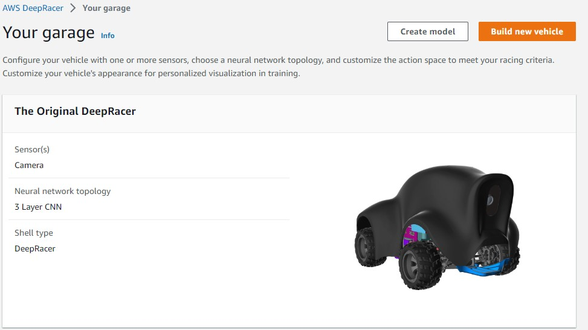
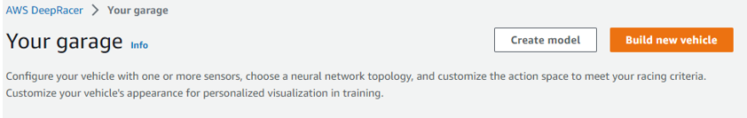
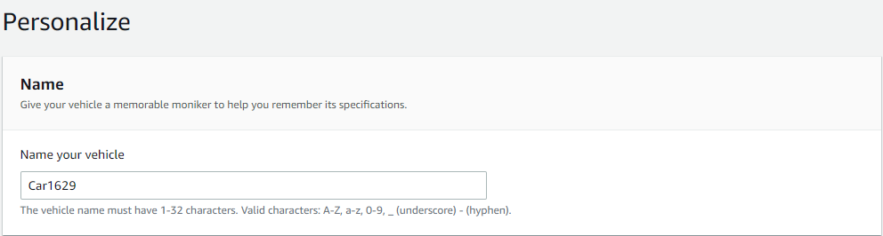
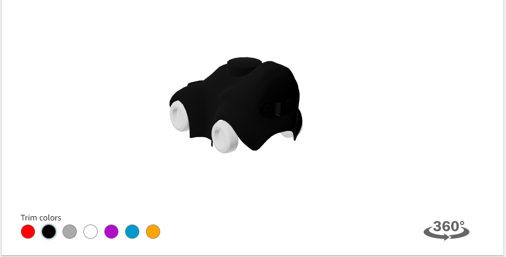
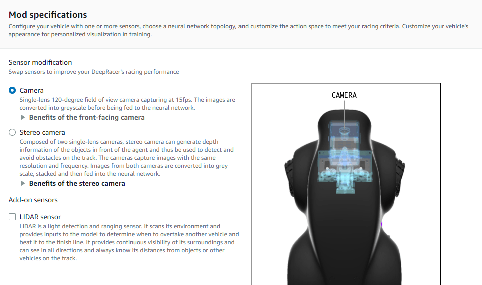

# Chương 2. Xây dựng mô hình
## 2.1. Ga-ra
### 2.1.1. Phương tiện mặc định
- Định cấu hình phương tiện của bạn bằng một hoặc nhiều cảm biến, chọn cấu trúc liên kết mạng thần kinh và tùy chỉnh không gian hành động để đáp ứng tiêu chí đua xe của bạn. Tùy chỉnh diện mạo phương tiện của bạn để có hình ảnh cá nhân hóa trong quá trình đào tạo.
- Mặc định AWS cung cấp cho ta một phương tiện có cấu tạo gồm 1 camera mặt trước và cấu trúc mạng nơ ron phức hợp 3 lớp (3 layer CNN).

### 2.1.2.	Tùy chỉnh phương tiện
- **Để tạo mới một phương tiện ta chọn build new vehicle.**

- **Ta tiến hành đặt tên cho phương tiện**

- **Chúng ta có thể thay đổi diện mạo cho phương tiện của mình bằng cách chọn vào màu sắc mong muốn**

- **Tùy chọn loại camera để phù hợp với mục đích đào tạo.**
- - Nếu bạn muốn đua trên một chiếc xe duy nhất trên đường đua time-trial , hãy cân nhắc sử dụng camera đơn. Để đua quanh một đường đua mà không có xe hoặc chướng ngại vật khác, bạn không cần phải có đầu vào phức tạp, hơn nữa, bạn càng đi càng phức tạp thì quá trình đào tạo sẽ mất nhiều thời gian hơn.
- - Cân nhắc sử dụng cảm biến camera âm thanh nổi khi bạn muốn xây dựng mô hình tránh vật thể hoặc mô hình đua xe head-to-head. Bạn sẽ cần sử dụng chức năng phần thưởng theo cách để mô hình học được các đặc điểm chiều sâu từ hình ảnh của bạn, điều có thể làm được với máy ảnh âm thanh nổi. Lưu ý rằng trong các mô hình đua xe đối đầu, camera âm thanh nổi có thể không đủ để che các điểm mù.
- - Cân nhắc thêm LIDAR vào mô hình của bạn nếu bạn muốn tham gia vào các cuộc đua head-to-head. Cảm biến LIDAR hướng về phía sau và quét cách xe khoảng 0,5m. Nó sẽ phát hiện những chiếc xe đang tiến đến từ phía sau hoặc trong những điểm mù khi rẽ.

- **Sau khi hoàn tất xe mới sẽ xuất hiện bên trong ga-ra**
## 2.2. Xây dựng mô hình
## 2.3. Dánh giá hiệu suất
