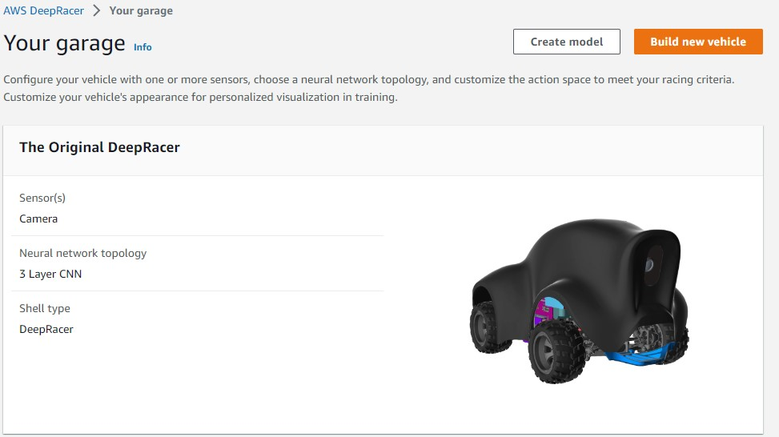
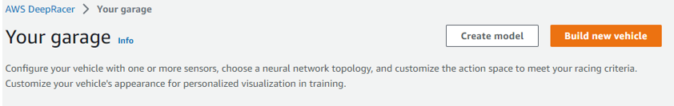
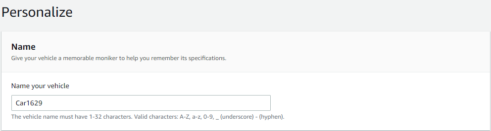
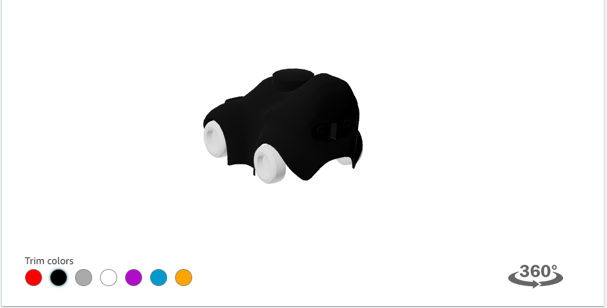
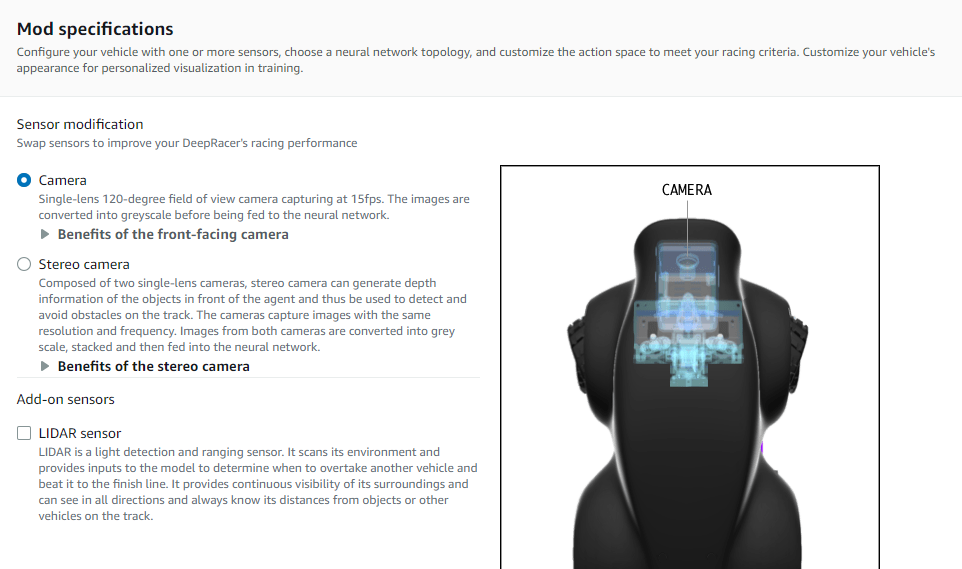
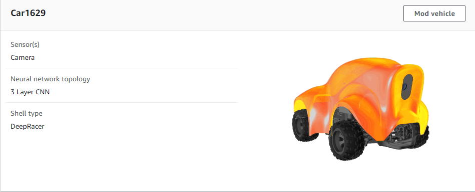

# Chương 2. Xây dựng mô hình
## 2.1. Ga-ra
### 2.1.1. Phương tiện mặc định
- Định cấu hình phương tiện của bạn bằng một hoặc nhiều cảm biến, chọn cấu trúc liên kết mạng thần kinh và tùy chỉnh không gian hành động để đáp ứng tiêu chí đua xe của bạn. Tùy chỉnh diện mạo phương tiện của bạn để có hình ảnh cá nhân hóa trong quá trình đào tạo.
- Mặc định AWS cung cấp cho ta một phương tiện có cấu tạo gồm 1 camera mặt trước và cấu trúc mạng nơ ron phức hợp 3 lớp (3 layer CNN).

### 2.1.2.	Tùy chỉnh phương tiện
- **Để tạo mới một phương tiện ta chọn build new vehicle.**

- **Ta tiến hành đặt tên cho phương tiện**

- **Chúng ta có thể thay đổi diện mạo cho phương tiện của mình bằng cách chọn vào màu sắc mong muốn**

- **Tùy chọn loại camera để phù hợp với mục đích đào tạo.**
    - Nếu bạn muốn đua trên một chiếc xe duy nhất trên đường đua time-trial , hãy cân nhắc sử dụng camera đơn. Để đua quanh một đường đua mà không có xe hoặc chướng ngại vật khác, bạn không cần phải có đầu vào phức tạp, hơn nữa, bạn càng đi càng phức tạp thì quá trình đào tạo sẽ mất nhiều thời gian hơn.
    - Cân nhắc sử dụng cảm biến camera âm thanh nổi khi bạn muốn xây dựng mô hình tránh vật thể hoặc mô hình đua xe head-to-head. Bạn sẽ cần sử dụng chức năng phần thưởng theo cách để mô hình học được các đặc điểm chiều sâu từ hình ảnh của bạn, điều có thể làm được với máy ảnh âm thanh nổi. Lưu ý rằng trong các mô hình đua xe đối đầu, camera âm thanh nổi có thể không đủ để che các điểm mù.
    - Cân nhắc thêm LIDAR vào mô hình của bạn nếu bạn muốn tham gia vào các cuộc đua head-to-head. Cảm biến LIDAR hướng về phía sau và quét cách xe khoảng 0,5m. Nó sẽ phát hiện những chiếc xe đang tiến đến từ phía sau hoặc trong những điểm mù khi rẽ.

- **Sau khi hoàn tất xe mới sẽ xuất hiện bên trong ga-ra**

## 2.2. Xây dựng mô hình
### 2.2.1. Tên mô hình và loại đường đua
- **Nhấn chọn Create model bắt đầu xây dựng mô hình bao gồm môi trường và phương tiện cần phải đào tạo để có thể tham gia các cuộc đua sau này.**

- **Đặt tên cho mô hình cần tạo**

- **Chọn loại đường đua: Có rất nhiều đường đua để bạn lựa chọn từ các cuộc đua đã diễn ra trước đó.**

### 2.2.1. Hình thức đua
Có 3 chế độ đua có thể lựa chọn:
- **Time trial**: chạy đua với thời gian mà không có vật cản hoặc đối thủ nào khác đang cạnh tranh

- **Object avoidance**: Xe đua trên đường đua hai làn với một số chướng ngại vật cố định được đặt dọc theo đường đua. 

    - Ở chế độ này ta có thể chọn tiêu chí để đào tạo, đồng thời chọn số vật cản trên đường đua:
       - Fixed location: vị trí các đối tượng (box) được phân bố đều trên đường đua.
       - Random location: vị trí các đối tượng(box) được phân bố một cách ngẫu nhiên trên đường đua. Do đó việc đào tạo 1 phương tiện sẽ mất nhiều thời gian hơn so với Fixed location.
-	**Head-to-head**: Ở chế độ này chiếc xe của chúng ta sẽ đua với các phương tiện khác trên đường đua có 2 làn. 
  
Chúng ta có thể chọn số phương tiện trên đường đua kèm tốc độ được định sẵn, cũng như chọn thời gian nhỏ nhất và ngắn nhất để các xe này thay đổi làn đua một cách ngẫu nhiên.
### 2.2.3.	 Thuật toán huấn luyện và siêu tham số
**Có 2 thuật toán huấn luyện**: PPO và SAC
-	PPO: Thuật toán với policy gần
-	SAC: Thuật toán với policy ngẫu nhiên
  
**Sự khác biệt cơ bản giữa 2 thuật toán**:

| Proximal Policy Optimization (PPO)  | Soft Actor Critic (SAC) |
| ---------------------------------------------------------------------- | ---------------------------------------------------------------------- |
| Hoạt động trong cả không gian hành động liên tục và rời rạc | Chỉ hoạt động trong không gian hành động liên tục  |
| Hoạt động trong policy  | Hoạt động ngoài policy  |
| Sử dụng chính quy hóa entrophy   | Thêm entrophy vào mục tiêu tối ưu hóa |

Chọn các siêu tham số:
 
- Thuật toán PPO:  
  
 
- Thuật toán SAC: 
 
 
**Định nghĩa các siêu tham số** 

| Tham số | Định nghĩa |
| ---------------------------------------------------------------------- | ---------------------------------------------------------------------- |
| Batch size | Số lượng experience xe gần đây được lấy mẫu ngẫu nhiên từ bộ đệm trải nghiệm và được sử dụng để cập nhật trọng số mạng nơ-ron. Nếu bạn có 5120 experience trong bộ đệm và chỉ định kích thước batch là 512, sau đó bỏ qua lấy mẫu ngẫu nhiên, bạn sẽ nhận được 10 batch experience. Lần lượt, mỗi batch sẽ được sử dụng để cập nhật trọng số mạng thần kinh của bạn trong quá trình đào tạo. Sử dụng kích thước batch lớn hơn để thúc đẩy cập nhật ổn định và trơn tru hơn đối với trọng số mạng nơ-ron, nhưng lưu ý khả năng quá trình đào tạo có thể chậm hơn.  |
| Number of epochs | Một epoch đại diện cho một lần đi qua tất cả các batch, trong đó trọng số mạng nơ-ron được cập nhật sau mỗi batch được xử lý, trước khi tiếp tục với batch tiếp theo. 10 epochs ngụ ý rằng bạn sẽ cập nhật trọng số mạng nơ-ron, sử dụng tất cả các batch một lần, nhưng lặp lại quá trình này 10 lần. Sử dụng số lượng epoch lớn hơn để thúc đẩy các bản cập nhật ổn định hơn, nhưng mong đợi quá trình đào tạo chậm hơn. Khi kích thước batch nhỏ, bạn có thể sử dụng số lượng epoch nhỏ hơn.  |
| Learning rate | Tốc độ học tập kiểm soát mức độ cập nhật đối với trọng số mạng nơ-ron. Nói một cách đơn giản, khi bạn cần thay đổi trọng số của chính sách của mình để đạt được phần thưởng tích lũy tối đa, bạn nên thay đổi chính sách của mình bao nhiêu. Tỷ lệ học tập lớn hơn sẽ dẫn đến đào tạo nhanh hơn, nhưng nó có thể gặp khó khăn để hội tụ. Tỷ lệ học tập nhỏ hơn dẫn đến sự hội tụ ổn định, nhưng có thể mất nhiều thời gian để đào tạo. |
| Exploration  | Điều này đề cập đến phương pháp được sử dụng để xác định sự đánh đổi giữa thăm dò và khai thác. Nói cách khác, chúng ta nên sử dụng phương pháp nào để xác định khi nào chúng ta nên ngừng khám phá (lựa chọn ngẫu nhiên các hành động) và khi nào chúng ta nên khai thác kinh nghiệm mà chúng ta đã tích lũy được. Vì chúng tôi sẽ sử dụng không gian hành động rời rạc, bạn nên luôn chọn CategoricalParameters. |
| Entropy | Một mức độ không chắc chắn, hoặc ngẫu nhiên, được thêm vào phân phối xác suất của không gian hành động. Điều này giúp thúc đẩy việc lựa chọn các hành động ngẫu nhiên để khám phá trạng thái / không gian hành động một cách rộng rãi hơn. |
| Discount factor | Hệ số chỉ định mức độ đóng góp của phần thưởng trong tương lai vào phần thưởng tích lũy dự kiến. Hệ số chiết khấu càng lớn thì mô hình càng xa để xác định phần thưởng tích lũy mong đợi và đào tạo càng chậm. Với hệ số chiết khấu là 0,9, chiếc xe bao gồm phần thưởng từ thứ tự 10 bước trong tương lai để thực hiện một bước di chuyển. Với hệ số chiết khấu là 0,999, chiếc xe sẽ xem xét phần thưởng từ thứ tự 1000 bước trong tương lai để thực hiện một bước đi. Các giá trị hệ số chiết khấu được đề xuất là 0,99, 0,999 và 0,9999. |
| Loss type | Loại tổn thất chỉ định loại hàm mục tiêu (hàm chi phí) được sử dụng để cập nhật trọng số mạng. Các loại lỗi mất bình phương Huber và Trung bình hoạt động tương tự đối với các bản cập nhật nhỏ. Nhưng khi các bản cập nhật trở nên lớn hơn, tổn thất Huber có gia số nhỏ hơn so với tổn thất lỗi trung bình bình phương. Khi bạn gặp vấn đề về hội tụ, hãy sử dụng kiểu mất Huber. Khi độ hội tụ tốt và bạn muốn đào tạo nhanh hơn, hãy sử dụng kiểu mất lỗi bình phương trung bình. |
### 2.2.4.	Cách thức vận hành của mô hình
**Chọn không gian hành động:**
- **Không gian hành động liên tục**: Một không gian hành động liên tục cho phép tác nhân chọn một hành động từ một loạt các giá trị cho mỗi trạng thái.
- **Không gian hành động rời rạc**: Một không gian hành động rời rạc đại diện cho tất cả các hành động có thể có của tác nhân đối với từng trạng thái trong một tập hợp hữu hạn.  

- **Steering angle(Góc lái)**: Các tham số của không gian liên tục: Góc lái xác định phạm vi góc lái mà bánh trước của mô hình của bạn có thể quay.
- **Speed(Tốc độ)**: Tốc độ mà mô hình có thể đạt được. Tốc độ tối đa/tối thiểu được xác định sẵn cho mô hình.

     Các tham số của không gian liên tục:
 

    Các tham số của không gian rời rạc:
 

    Chọn phương tiện cần đào tạo( có thể chọn phương tiện tự tạo hoặc mặc định)

### 2.2.5.	Tinh chỉnh thuật toán thưởng và điều kiện dừng
**Thuật toán thưởng( reward function):** ta có thể điều chỉnh để giúp model trở nên tốt hơn. Thuật toán thưởng mặc định khuyến khích model chạy sát đường trung tâm đường đua. 

Khi chạy gần đường trung tâm thì phần thưởng nhận được sẽ cao hơn và ngược lại.

**Thuật toán khuyến khích đối tượng chạy trong đường đua.**

**Thuật toán không cho đối tượng chạy theo zig-zag: giúp đối tượng đi gần trung tâm đường đua và tránh đánh lái quá nhiều.**

**Thuật đối tượng tránh đối tượng và đối đầu - đi trên một làn đường và không va chạm (mặc định cho OA và h2h)**

Chức năng phần thưởng này thưởng cho tác nhân vì đã ở bên trong đường viền của đường đua và phạt tác nhân vì đã đến quá gần các vật thể phía trước nó. Đặc vụ có thể di chuyển từ làn này sang làn khác để tránh va chạm. Tổng phần thưởng là tổng trọng số của phần thưởng và hình phạt. Ví dụ này mang lại nhiều trọng lượng hơn cho hình phạt trong nỗ lực tránh va chạm. Thử nghiệm với các trọng số trung bình khác nhau để huấn luyện cho các kết quả hành vi khác nhau.

Các inputparameter của thuật toán thưởng

| Parameter | Ý nghĩa |
| ---------------------------------------------------------------------- | ---------------------------------------------------------------------- |
| "all_wheels_on_track": Boolean | Cờ đánh dấu trạng thái tất cả bánh xe có nằm trong đường đua. |
| "x": float | Tọa độ x của agent tính bằng mét |
| "y": float | Tọa độ y của agent tính bằng mét |
| "closest_objects": [int, int] | Các chỉ số dựa trên zero-based của hai đối tượng gần nhất với vị trí hiện tại của agent (x, y). |
| "closest_waypoints": [int, int] | Chỉ số của hai điểm tham chiếu gần nhất. |
| "distance_from_center": float | Khoảng cách tính bằng mét từ trung tâm đường đua |
| "is_crashed": Boolean | Cờ booleen cho biết agent có lỗi hay không |
| "is_left_of_center": Boolean | Cờ booleen cho biết agent có bên phía trái so với đường trung tâm hay không. |
| "is_offtrack": Boolean | Cờ booleen cho biết agent có đi chệch hướng hay không |
| "is_reversed": Boolean | Cho biết agent đi theo chiều kim đồng hồ hay ngược chiều. |
| "Heading": float | Góc đầu xe xo với trục x. |
| "objects_distance": [float, ] | Danh sách khoảng cách của các đối tượng tính bằng mét giữa 0 và track_length liên quan đến vạch xuất phát. |
| "objects_heading": [float, ] | Danh sách các heading của đối tượng theo độ giữa -180 và 180. |
| "objects_left_of_center": [Boolean, ] | danh sách các cờ Boolean cho biết các đối tượng của phần tử có ở bên trái tâm (Đúng) hay không (Sai) |
| "objects_location":[(float, float),] | Danh sách các vị trí đối tượng [(x,y), ...]. |
| "objects_speed": [float, ] | Danh sách tốc độ của các đối tượng tính bằng mét trên giây.  |
| "progress": float | Phần trăm đường đua đã hoàn thành  |
| "speed": float | Tốc độ của đối tượng được tính bằng mét trên giây |
| "steering_angle": float | Góc lái của đối tượng được tính bằng độ |
| "steps": int, | Số lượng các bước đã hoàn thành. |
| "track_length": float | Chiều dài đường đua được tính bằng mét. |
| "track_width": float | Chiều rộng đường đua được tính bằng mét. |
| "waypoints": [(float, float), ] | danh sách (x,y) là các cột mốc dọc theo trung tâm đường đua |

Từ đó ta phát triển thuật toán thưởng từ các parameter để model có thể hoàn thành cuộc đua một cách tối ưu nhất. 

**Thuật toán thưởng nâng cao:** Đối tượng đi gần đường trung tâm với tốc độ cao và ít thay đổi góc lái sẽ có phần thưởng cao hơn và ngược lại.

**Điều kiện dừng:** khoảng thời gian lớn nhất để đào tạo cho model. Khoảng thời gian này nằm từ 5 đến 1440 phút.

Ta có thể thử nghiệm độ hiệu quả sau khi đào tạo bằng cách tham dự cuộc đua 2022 re:Invert Warm Up  

## 2.3. Đào tạo và đánh giá mô hình
AWS DeepRacer thúc đẩy Amazon SageMaker đào tạo mô hình của bạn ở hậu trường và sử dụng AWS RoboMaker để mô phỏng tương tác của tác nhân với môi trường. Theo dõi cách model hành xử trong môi trường đã chọn, theo quy định của chức năng phần thưởng.

Biểu đồ đào tạo ( sau khoảng thơi gian 30 phút) 

**Đánh giá thuật toán thưởng sau khi đào tạo**
- Sau khi đào tạo thành công thì model hoàn tất 3 vòng đua với thuật toán thưởng là đi ven đường trung tâm( mất khoảng 39 giây để hoàng thành 1 lap) 

## 2.1. Ga-ra
### 2.1.1. Phương tiện mặc định
- Định cấu hình phương tiện của bạn bằng một hoặc nhiều cảm biến, chọn cấu trúc liên kết mạng thần kinh và tùy chỉnh không gian hành động để đáp ứng tiêu chí đua xe của bạn. Tùy chỉnh diện mạo phương tiện của bạn để có hình ảnh cá nhân hóa trong quá trình đào tạo.
- Mặc định AWS cung cấp cho ta một phương tiện có cấu tạo gồm 1 camera mặt trước và cấu trúc mạng nơ ron phức hợp 3 lớp (3 layer CNN).

### 2.1.2.	Tùy chỉnh phương tiện
- **Để tạo mới một phương tiện ta chọn build new vehicle.**

- **Ta tiến hành đặt tên cho phương tiện**

- **Chúng ta có thể thay đổi diện mạo cho phương tiện của mình bằng cách chọn vào màu sắc mong muốn**

- **Tùy chọn loại camera để phù hợp với mục đích đào tạo.**
    - Nếu bạn muốn đua trên một chiếc xe duy nhất trên đường đua time-trial , hãy cân nhắc sử dụng camera đơn. Để đua quanh một đường đua mà không có xe hoặc chướng ngại vật khác, bạn không cần phải có đầu vào phức tạp, hơn nữa, bạn càng đi càng phức tạp thì quá trình đào tạo sẽ mất nhiều thời gian hơn.
    - Cân nhắc sử dụng cảm biến camera âm thanh nổi khi bạn muốn xây dựng mô hình tránh vật thể hoặc mô hình đua xe head-to-head. Bạn sẽ cần sử dụng chức năng phần thưởng theo cách để mô hình học được các đặc điểm chiều sâu từ hình ảnh của bạn, điều có thể làm được với máy ảnh âm thanh nổi. Lưu ý rằng trong các mô hình đua xe đối đầu, camera âm thanh nổi có thể không đủ để che các điểm mù.
    - Cân nhắc thêm LIDAR vào mô hình của bạn nếu bạn muốn tham gia vào các cuộc đua head-to-head. Cảm biến LIDAR hướng về phía sau và quét cách xe khoảng 0,5m. Nó sẽ phát hiện những chiếc xe đang tiến đến từ phía sau hoặc trong những điểm mù khi rẽ.

- **Sau khi hoàn tất xe mới sẽ xuất hiện bên trong ga-ra**

## 2.2. Xây dựng mô hình
### 2.2.1. Tên mô hình và loại đường đua
- **Nhấn chọn Create model bắt đầu xây dựng mô hình bao gồm môi trường và phương tiện cần phải đào tạo để có thể tham gia các cuộc đua sau này.**

- **Đặt tên cho mô hình cần tạo**

- **Chọn loại đường đua: Có rất nhiều đường đua để bạn lựa chọn từ các cuộc đua đã diễn ra trước đó.**

### 2.2.1. Hình thức đua
Có 3 chế độ đua có thể lựa chọn:
- **Time trial**: chạy đua với thời gian mà không có vật cản hoặc đối thủ nào khác đang cạnh tranh

- **Object avoidance**: Xe đua trên đường đua hai làn với một số chướng ngại vật cố định được đặt dọc theo đường đua. 

    - Ở chế độ này ta có thể chọn tiêu chí để đào tạo, đồng thời chọn số vật cản trên đường đua:
       - Fixed location: vị trí các đối tượng (box) được phân bố đều trên đường đua.
       - Random location: vị trí các đối tượng(box) được phân bố một cách ngẫu nhiên trên đường đua. Do đó việc đào tạo 1 phương tiện sẽ mất nhiều thời gian hơn so với Fixed location.
-	**Head-to-head**: Ở chế độ này chiếc xe của chúng ta sẽ đua với các phương tiện khác trên đường đua có 2 làn. 
  
Chúng ta có thể chọn số phương tiện trên đường đua kèm tốc độ được định sẵn, cũng như chọn thời gian nhỏ nhất và ngắn nhất để các xe này thay đổi làn đua một cách ngẫu nhiên.
### 2.2.3.	 Thuật toán huấn luyện và siêu tham số
**Có 2 thuật toán huấn luyện**: PPO và SAC
-	PPO: Thuật toán với policy gần
-	SAC: Thuật toán với policy ngẫu nhiên
  
**Sự khác biệt cơ bản giữa 2 thuật toán**:

| Proximal Policy Optimization (PPO)  | Soft Actor Critic (SAC) |
| ---------------------------------------------------------------------- | ---------------------------------------------------------------------- |
| Hoạt động trong cả không gian hành động liên tục và rời rạc | Chỉ hoạt động trong không gian hành động liên tục  |
| Hoạt động trong policy  | Hoạt động ngoài policy  |
| Sử dụng chính quy hóa entrophy   | Thêm entrophy vào mục tiêu tối ưu hóa |

Chọn các siêu tham số:
 
- Thuật toán PPO:  
  
 
- Thuật toán SAC: 
 
 
**Định nghĩa các siêu tham số** 

| Tham số | Định nghĩa |
| ---------------------------------------------------------------------- | ---------------------------------------------------------------------- |
| Batch size | Số lượng experience xe gần đây được lấy mẫu ngẫu nhiên từ bộ đệm trải nghiệm và được sử dụng để cập nhật trọng số mạng nơ-ron. Nếu bạn có 5120 experience trong bộ đệm và chỉ định kích thước batch là 512, sau đó bỏ qua lấy mẫu ngẫu nhiên, bạn sẽ nhận được 10 batch experience. Lần lượt, mỗi batch sẽ được sử dụng để cập nhật trọng số mạng thần kinh của bạn trong quá trình đào tạo. Sử dụng kích thước batch lớn hơn để thúc đẩy cập nhật ổn định và trơn tru hơn đối với trọng số mạng nơ-ron, nhưng lưu ý khả năng quá trình đào tạo có thể chậm hơn.  |
| Number of epochs | Một epoch đại diện cho một lần đi qua tất cả các batch, trong đó trọng số mạng nơ-ron được cập nhật sau mỗi batch được xử lý, trước khi tiếp tục với batch tiếp theo. 10 epochs ngụ ý rằng bạn sẽ cập nhật trọng số mạng nơ-ron, sử dụng tất cả các batch một lần, nhưng lặp lại quá trình này 10 lần. Sử dụng số lượng epoch lớn hơn để thúc đẩy các bản cập nhật ổn định hơn, nhưng mong đợi quá trình đào tạo chậm hơn. Khi kích thước batch nhỏ, bạn có thể sử dụng số lượng epoch nhỏ hơn.  |
| Learning rate | Tốc độ học tập kiểm soát mức độ cập nhật đối với trọng số mạng nơ-ron. Nói một cách đơn giản, khi bạn cần thay đổi trọng số của chính sách của mình để đạt được phần thưởng tích lũy tối đa, bạn nên thay đổi chính sách của mình bao nhiêu. Tỷ lệ học tập lớn hơn sẽ dẫn đến đào tạo nhanh hơn, nhưng nó có thể gặp khó khăn để hội tụ. Tỷ lệ học tập nhỏ hơn dẫn đến sự hội tụ ổn định, nhưng có thể mất nhiều thời gian để đào tạo. |
| Exploration  | Điều này đề cập đến phương pháp được sử dụng để xác định sự đánh đổi giữa thăm dò và khai thác. Nói cách khác, chúng ta nên sử dụng phương pháp nào để xác định khi nào chúng ta nên ngừng khám phá (lựa chọn ngẫu nhiên các hành động) và khi nào chúng ta nên khai thác kinh nghiệm mà chúng ta đã tích lũy được. Vì chúng tôi sẽ sử dụng không gian hành động rời rạc, bạn nên luôn chọn CategoricalParameters. |
| Entropy | Một mức độ không chắc chắn, hoặc ngẫu nhiên, được thêm vào phân phối xác suất của không gian hành động. Điều này giúp thúc đẩy việc lựa chọn các hành động ngẫu nhiên để khám phá trạng thái / không gian hành động một cách rộng rãi hơn. |
| Discount factor | Hệ số chỉ định mức độ đóng góp của phần thưởng trong tương lai vào phần thưởng tích lũy dự kiến. Hệ số chiết khấu càng lớn thì mô hình càng xa để xác định phần thưởng tích lũy mong đợi và đào tạo càng chậm. Với hệ số chiết khấu là 0,9, chiếc xe bao gồm phần thưởng từ thứ tự 10 bước trong tương lai để thực hiện một bước di chuyển. Với hệ số chiết khấu là 0,999, chiếc xe sẽ xem xét phần thưởng từ thứ tự 1000 bước trong tương lai để thực hiện một bước đi. Các giá trị hệ số chiết khấu được đề xuất là 0,99, 0,999 và 0,9999. |
| Loss type | Loại tổn thất chỉ định loại hàm mục tiêu (hàm chi phí) được sử dụng để cập nhật trọng số mạng. Các loại lỗi mất bình phương Huber và Trung bình hoạt động tương tự đối với các bản cập nhật nhỏ. Nhưng khi các bản cập nhật trở nên lớn hơn, tổn thất Huber có gia số nhỏ hơn so với tổn thất lỗi trung bình bình phương. Khi bạn gặp vấn đề về hội tụ, hãy sử dụng kiểu mất Huber. Khi độ hội tụ tốt và bạn muốn đào tạo nhanh hơn, hãy sử dụng kiểu mất lỗi bình phương trung bình. |
### 2.2.4.	Cách thức vận hành của mô hình
**Chọn không gian hành động:**
- **Không gian hành động liên tục**: Một không gian hành động liên tục cho phép tác nhân chọn một hành động từ một loạt các giá trị cho mỗi trạng thái.
- **Không gian hành động rời rạc**: Một không gian hành động rời rạc đại diện cho tất cả các hành động có thể có của tác nhân đối với từng trạng thái trong một tập hợp hữu hạn.  

- **Steering angle(Góc lái)**: Các tham số của không gian liên tục: Góc lái xác định phạm vi góc lái mà bánh trước của mô hình của bạn có thể quay.
- **Speed(Tốc độ)**: Tốc độ mà mô hình có thể đạt được. Tốc độ tối đa/tối thiểu được xác định sẵn cho mô hình.

     Các tham số của không gian liên tục:
 

    Các tham số của không gian rời rạc:
 

    Chọn phương tiện cần đào tạo( có thể chọn phương tiện tự tạo hoặc mặc định)

### 2.2.5.	Tinh chỉnh thuật toán thưởng và điều kiện dừng
**Thuật toán thưởng( reward function):** ta có thể điều chỉnh để giúp model trở nên tốt hơn. Thuật toán thưởng mặc định khuyến khích model chạy sát đường trung tâm đường đua. 

Khi chạy gần đường trung tâm thì phần thưởng nhận được sẽ cao hơn và ngược lại. Từ đó ta phát triển thuật toán thưởng từ các parameter để model có thể hoàn thành cuộc đua một cách tối ưu nhất. 
**Điều kiện dừng:** khoảng thời gian lớn nhất để đào tạo cho model. Khoảng thời gian này nằm từ 5 đến 1440 phút.

Ta có thể thử nghiệm độ hiệu quả sau khi đào tạo bằng cách tham dự cuộc đua 2022 re:Invert Warm Up  

## 2.3. Đào tạo và đánh giá mô hình
AWS DeepRacer thúc đẩy Amazon SageMaker đào tạo mô hình của bạn ở hậu trường và sử dụng AWS RoboMaker để mô phỏng tương tác của tác nhân với môi trường. Theo dõi cách model hành xử trong môi trường đã chọn, theo quy định của chức năng phần thưởng.

Biểu đồ đào tạo ( sau khoảng thơi gian 30 phút) 

**Đánh giá thuật toán thưởng sau khi đào tạo**
- Sau khi đào tạo thành công thì model hoàn tất 3 vòng đua với thuật toán thưởng là đi ven đường trung tâm( mất khoảng 39 giây để hoàng thành 1 lap) 

